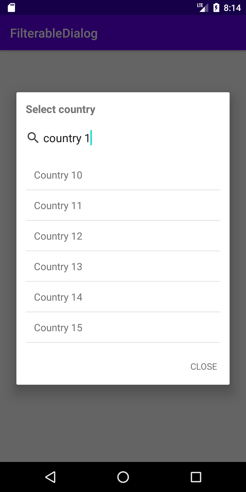

# FilterableDialog
Android Library to filter list of selections

# How to use
 // get instance from FilterableDialog
  val filterableDialog = FilterableDialog(this, countries, getString(R.string.select_country))

  // to show it
 filterableDialog.show(onSearchItemSelected = { _, item ->
            // handle select item
            filterableDialog.dismiss()
            select_country_text.text = item.title
        })

# Download

Step 1.
Add it in your root build.gradle at the end of repositories:

allprojects {

	repositories {
		...
		maven { url 'https://jitpack.io' }

	}

}

Step 2. Add the dependency

dependencies {

implementation 'com.github.mahmoudashrafmohamed:FilterableDialog:1.0.0'

}
